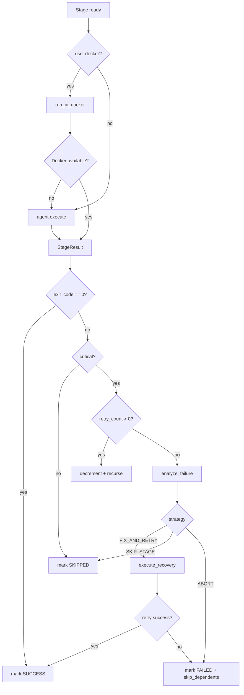

# Design Document: CI/CD Orchestrator Audit & Fix

## Overview

This document describes the complete architecture of the AI-powered CI/CD Pipeline Orchestrator — a full-stack system that accepts a Git repository URL and a plain-English deployment goal, analyzes the repository, generates a DAG-based pipeline, executes it with five specialized agents, streams real-time progress over WebSocket, and self-heals common failures automatically.

The audit-and-fix spec targets every listed feature: ensuring each is fully implemented, correctly wired end-to-end (frontend ↔ backend ↔ execution engine), and covered by automated tests (unit + integration + E2E).

### Technology Stack

| Layer | Technology |
|---|---|
| Backend runtime | Python 3.11, FastAPI, Uvicorn |
| Async DB | SQLAlchemy async + SQLite (dev) / PostgreSQL (prod) |
| Pipeline models | Pydantic v2 |
| DAG scheduling | NetworkX DiGraph |
| LLM integration | Google Gemini (`google-genai`), Anthropic Claude |
| Frontend | React 18, TypeScript, Vite |
| DAG visualization | ReactFlow 11, Dagre layout |
| Styling | Tailwind CSS |
| WebSocket (client) | Browser native WebSocket |
| Testing (backend) | pytest, pytest-asyncio, hypothesis |
| Testing (frontend) | Vitest, React Testing Library, Playwright |


---

## Architecture

### High-Level Data Flow

```mermaid
flowchart LR
    subgraph Frontend["Frontend (React/TS)"]
        UI["Pages & Components"]
        CTX["PipelineContext"]
        WS_CLIENT["useWebSocket hook"]
    end

    subgraph Backend["Backend (FastAPI)"]
        API["REST API\n/pipelines, /ws"]
        WS_MGR["ConnectionManager"]
        CREATOR["Creator\n(analyzer + generator)"]
        EXECUTOR["PipelineExecutor\n+ DAGScheduler"]
        REPLANNER["Replanner\n+ ErrorPatterns"]
        ARTIFACT["ArtifactStore"]
        DB["Repository\n(SQLAlchemy)"]
    end

    subgraph Storage["Persistence"]
        SQLITE["SQLite / PostgreSQL"]
        FS["/tmp/artifacts"]
    end

    UI -->|REST| API
    WS_CLIENT <-->|WebSocket /ws/{id}| WS_MGR
    API --> CREATOR
    API --> EXECUTOR
    EXECUTOR --> REPLANNER
    EXECUTOR --> ARTIFACT
    EXECUTOR --> WS_MGR
    API --> DB
    DB --> SQLITE
    ARTIFACT --> FS
```

### Backend Module Map

```
backend/src/
├── api/
│   ├── main.py          # FastAPI app, all REST + WS endpoints
│   └── websocket.py     # ConnectionManager (broadcast to pipeline subscribers)
├── creator/
│   ├── analyzer.py      # Git clone + repo analysis → RepoAnalysis
│   ├── generator.py     # RepoAnalysis + goal → PipelineSpec (LLM-assisted)
│   ├── goal_parser.py   # NLP extraction: cloud, env, region, strategy
│   ├── llm_generator.py # LLM prompt construction and response parsing
│   └── templates/       # Language-specific stage command templates
├── executor/
│   ├── dispatcher.py    # PipelineExecutor: orchestrates run(), recovery
│   ├── scheduler.py     # DAGScheduler: topological ordering, status tracking
│   ├── replanner.py     # analyze_failure() + execute_recovery()
│   ├── error_patterns.py# ErrorPattern registry + detect/apply/reason
│   ├── artifact_store.py# ArtifactStore: save/get/cleanup artifacts
│   ├── docker_runner.py # run_in_docker(): containerized stage execution
│   ├── cloud_adapters.py# CloudAdapter: AWS/Azure/GCP rollback support
│   ├── port_utils.py    # Port conflict detection and free-port finding
│   └── agents/
│       ├── base.py      # BaseAgent: run_command() with streaming + timeout
│       ├── build_agent.py
│       ├── test_agent.py
│       ├── security_agent.py
│       ├── deploy_agent.py
│       └── verify_agent.py
├── db/
│   ├── models.py        # SQLAlchemy ORM: PipelineRow, StageResultRow, DeploymentVersionRow
│   ├── repository.py    # Async CRUD functions
│   └── session.py       # Engine + session factory + init_db()
└── models/
    ├── pipeline.py      # Pydantic: PipelineSpec, Stage, RepoAnalysis, DeploymentVersion
    └── messages.py      # Pydantic: StageRequest, StageResult, RecoveryPlan, PipelineExecutionResult
```

### Frontend Module Map

```
frontend/src/
├── App.tsx              # Router: PipelineView, NewPipelinePage, page routes
├── api/client.ts        # Typed fetch wrappers for all REST endpoints
├── context/
│   └── PipelineContext.tsx  # Global state: pipeline, stages, logs, parallel executions
├── hooks/
│   ├── useWebSocket.ts      # WS connect/reconnect, message dispatch
│   ├── usePipeline.ts       # Pipeline CRUD + execution actions
│   └── useParallelExecution.ts  # Multi-pipeline parallel execution state
├── components/
│   ├── Layout.tsx           # Sidebar nav + main content shell
│   ├── PipelineDAG.tsx      # ReactFlow DAG renderer
│   ├── StageNode.tsx        # Custom ReactFlow node (status color, agent label)
│   ├── StageDetailPanel.tsx # Slide-in panel: stdout, stderr, recovery, artifacts
│   ├── ExecutionControls.tsx# Run / Re-run Failed / Stop / Regenerate buttons
│   ├── ExecutionLog.tsx     # Scrolling log panel with color-coded entries
│   ├── ActiveExecutionTabs.tsx  # Tabs for parallel pipeline executions
│   ├── AgentActivity.tsx    # Live agent status sidebar
│   ├── StatusBanner.tsx     # Overall status + deploy URL link
│   ├── CreatePipeline.tsx   # New pipeline form
│   └── EditPipeline.tsx     # Edit name/goal/stage commands
├── pages/
│   ├── DashboardPage.tsx    # Aggregate stats + recent pipelines
│   ├── PipelinesPage.tsx    # Full pipeline list with filters + actions
│   ├── AgentsPage.tsx       # Agent metrics history
│   ├── LogsPage.tsx         # Cross-pipeline log search + download
│   └── SettingsPage.tsx     # Profile, API keys, cloud credentials
├── types/pipeline.ts        # TypeScript interfaces mirroring backend Pydantic models
└── utils/
    ├── dagLayout.ts         # Dagre layout: createNodesAndEdges()
    └── statusColors.ts      # Status → color mapping
```


---

## Components and Interfaces

### REST API Endpoints

| Method | Path | Description |
|---|---|---|
| GET | `/health` | Health check |
| POST | `/pipelines` | Create pipeline (clone + analyze + generate) |
| GET | `/pipelines` | List all pipelines with latest results |
| GET | `/pipelines/{id}` | Get pipeline spec |
| PATCH | `/pipelines/{id}` | Update name, goal, or stages |
| DELETE | `/pipelines/{id}` | Delete pipeline + cascade results |
| POST | `/pipelines/{id}/execute` | Execute pipeline |
| POST | `/pipelines/{id}/execute-failed` | Re-run only failed stages |
| POST | `/pipelines/{id}/chain` | Chain sequential pipeline execution |
| POST | `/pipelines/{id}/rollback` | Rollback to previous deployment version |
| GET | `/pipelines/{id}/results` | Get execution results |
| GET | `/pipelines/{id}/deployment-history` | Get deployment version history |
| POST | `/pipelines/stop-app` | Kill running app on known ports |
| GET | `/parse-goal` | Parse goal string → structured parameters |
| WS | `/ws/{pipeline_id}` | Real-time stage event stream |

### Key Request/Response Schemas

**POST /pipelines** (query params: `repo_url`, `goal`, `use_docker`, `name`)
Returns: `PipelineSpec`

**PATCH /pipelines/{id}** body:
```json
{ "name": "string", "goal": "string", "stages": [Stage] }
```

**POST /pipelines/{id}/chain** body:
```json
{ "pipeline_ids": ["id1", "id2"] }
```
Returns: `{ "chain_results": { "id": { "status": "...", "goal_achieved": bool } } }`

**GET /pipelines** returns list of:
```json
{
  "pipeline": PipelineSpec,
  "results": PipelineExecutionResult | null,
  "completedAt": "ISO8601",
  "overallStatus": "success|failed|not_executed",
  "goalAchieved": bool,
  "duration_seconds": float | null
}
```

### WebSocket Protocol

All messages are JSON objects sent from server to client on `/ws/{pipeline_id}`.

**Common fields on every message:**
```typescript
{
  stage_id: string,       // "" for pipeline-level events
  status: StageStatus,
  log_type: LogType,
  log_message: string
}
```

**Event types and additional fields:**

| `log_type` | Additional Fields |
|---|---|
| `pipeline_start` | — |
| `stage_start` | command preview (first 80 chars) |
| `stage_output` | `stdout_line: string` |
| `stage_success` | `duration_seconds: float`, optional `deploy_url: string` |
| `stage_failed` | `exit_code: int`, `log_tail: string` (last 200 chars stderr) |
| `stage_skipped` | — |
| `retry` | retries remaining count in message |
| `recovery_start` | `log_tail: string` |
| `recovery_plan` | `recovery_strategy`, `recovery_reason`, `modified_command` |
| `recovery_success` | `duration_seconds: float` |
| `recovery_failed` | — |
| `pipeline_done` | overall status, counts, goal achievement |

### Agent Interface

All five agents implement `BaseAgent`:

```python
class BaseAgent(ABC):
    async def execute(self, request: StageRequest) -> StageResult: ...
    async def run_command(self, cmd, cwd, timeout, env, on_output) -> StageResult: ...
```

`StageRequest` carries: `stage_id`, `command`, `working_dir`, `env_vars`, `timeout`, `artifacts_from`, `on_output` callback.

`StageResult` carries: `stage_id`, `status`, `exit_code`, `stdout`, `stderr`, `duration_seconds`, `artifacts`, `metadata`.

### Frontend Context Interface

`PipelineContext` exposes the full application state and all mutation actions. Key state slices:

- `currentPipeline: PipelineSpec | null` — the pipeline currently in view
- `stageStatuses: Map<string, StageStatus>` — live status per stage
- `stageResults: Map<string, StageResult>` — completed stage results
- `executionLogs: LogEntry[]` — ordered log entries for current run
- `activeExecutions: Map<string, ActiveExecution>` — parallel execution state per pipeline
- `recoveryPlans: Map<string, RecoveryPlan>` — recovery details per stage
- `deployUrl: string | null` — extracted deploy URL from last run


---

## Data Models

### Backend Pydantic Models

```python
class Stage(BaseModel):
    id: str
    agent: AgentType          # build | test | security | deploy | verify
    command: str
    depends_on: list[str]
    timeout_seconds: int = 300
    retry_count: int = 0
    critical: bool = True
    env_vars: dict[str, str] = {}

class RepoAnalysis(BaseModel):
    language: str
    framework: str | None
    package_manager: str
    has_dockerfile: bool
    has_tests: bool
    test_runner: str | None
    is_monorepo: bool
    deploy_target: str | None
    available_scripts: list[str]
    project_subdir: str | None

class PipelineSpec(BaseModel):
    pipeline_id: str          # UUID
    name: str
    repo_url: str
    goal: str
    created_at: datetime
    analysis: RepoAnalysis
    stages: list[Stage]
    work_dir: str
    use_docker: bool

class StageResult(BaseModel):
    stage_id: str
    status: StageStatus       # pending|running|success|failed|skipped
    exit_code: int
    stdout: str
    stderr: str
    duration_seconds: float
    artifacts: list[str]
    metadata: dict            # e.g. {"deploy_url": "http://..."}

class PipelineExecutionResult(BaseModel):
    pipeline_id: str
    overall_status: str       # success | failed
    goal_achieved: bool
    stages: dict[str, StageResult]
    final_output: dict[str, str]
    duration_seconds: float

class RecoveryPlan(BaseModel):
    strategy: RecoveryStrategy  # FIX_AND_RETRY | SKIP_STAGE | ROLLBACK | ABORT
    reason: str
    modified_command: str | None
    rollback_steps: list[str]

class DeploymentVersion(BaseModel):
    version_id: str
    pipeline_id: str
    timestamp: datetime
    image: str
    environment: str
    status: str               # success | failed | rolled_back
    health_check_passed: bool
    metadata: dict
```

### Database Schema (SQLAlchemy ORM)

**`pipelines` table**

| Column | Type | Notes |
|---|---|---|
| `pipeline_id` | String PK | UUID |
| `name` | String | |
| `repo_url` | String | |
| `goal` | String | |
| `created_at` | DateTime | |
| `work_dir` | String | Cloned repo path |
| `spec_json` | Text | Full `PipelineSpec` JSON |
| `overall_status` | String | `not_executed` \| `success` \| `failed` |
| `goal_achieved` | Text | `"true"` \| `"false"` |
| `execution_duration` | String | Float as string |

**`stage_results` table**

| Column | Type | Notes |
|---|---|---|
| `id` | String PK | UUID |
| `pipeline_id` | String FK → pipelines | CASCADE DELETE |
| `stage_id` | String | |
| `status` | String | |
| `exit_code` | String | |
| `stdout` | Text | |
| `stderr` | Text | |
| `duration_seconds` | String | |
| `result_json` | Text | Full `StageResult` JSON |

**`deployment_versions` table**

| Column | Type | Notes |
|---|---|---|
| `id` | String PK | UUID |
| `version_id` | String | UUID |
| `pipeline_id` | String FK → pipelines | |
| `timestamp` | DateTime | |
| `image` | String | Docker image or artifact ref |
| `environment` | String | staging \| production \| dev |
| `status` | String | success \| failed \| rolled_back |
| `health_check_passed` | String | `"true"` \| `"false"` |
| `deployment_metadata` | Text | JSON string |

### Frontend TypeScript Types

```typescript
type AgentType = 'build' | 'test' | 'security' | 'deploy' | 'verify';
type StageStatus = 'pending' | 'running' | 'success' | 'failed' | 'skipped';
type LogType = 'stage_start' | 'stage_success' | 'stage_failed' | 'stage_skipped'
             | 'stage_output' | 'retry' | 'recovery_start' | 'recovery_plan'
             | 'recovery_success' | 'recovery_failed' | 'pipeline_start'
             | 'pipeline_done' | 'info';

interface LogEntry {
  timestamp: string;
  stage_id?: string;
  type: LogType;
  message: string;
  details?: string;
}

interface HistoryEntry {
  pipeline: PipelineSpec;
  results: Record<string, StageResult> | null;
  completedAt: string;
  overallStatus: 'success' | 'failed' | 'partial';
  logs?: LogEntry[];
  duration_seconds?: number;
}
```


---

## DAG Execution Engine Design

### DAGScheduler

`DAGScheduler` wraps a `networkx.DiGraph` and tracks per-stage status. Key operations:

- **`__init__`**: Builds graph from `PipelineSpec.stages`, validates no cycles, validates all `depends_on` references exist.
- **`get_ready_stages()`**: Returns all `PENDING` stages whose every predecessor is `SUCCESS` or `SKIPPED`.
- **`mark_running(stage_id)`**: Transitions stage to `RUNNING`.
- **`mark_complete(stage_id, status, result)`**: Records final status and `StageResult`.
- **`skip_dependents(stage_id)`**: Uses `nx.descendants()` to mark all downstream `PENDING` stages as `SKIPPED`.
- **`reset_failed_stages()`**: Resets `FAILED` → `PENDING`, then iteratively un-skips stages whose failed predecessors are now `PENDING`.
- **`is_finished()`**: Returns `True` when no stage is `PENDING` or `RUNNING`.

### PipelineExecutor

`PipelineExecutor.run()` drives the main execution loop:

```
while not scheduler.is_finished():
    ready = scheduler.get_ready_stages()
    if not ready: break  # stalled
    await asyncio.gather(*[_execute_stage_with_recovery(sid) for sid in ready])
```

Parallel stages are dispatched with `asyncio.gather`, enabling true concurrent execution.

### Stage Execution Flow



### Inter-Stage Context Injection

Before each stage executes, `_collect_upstream_context()` injects:
- `STAGE_<ID>_STATUS`, `STAGE_<ID>_EXIT_CODE`, `STAGE_<ID>_DURATION` for each direct predecessor
- `ARTIFACT_<STAGE_ID>_<INDEX>` for each artifact path from the `ArtifactStore`
- All predecessor `metadata` keys as `STAGE_<ID>_<KEY>` env vars

Stage-defined `env_vars` take precedence over injected upstream vars.

### Port Conflict Auto-Recovery

For `AgentType.DEPLOY` stages, before execution the dispatcher:
1. Extracts the port from the command using regex patterns
2. Checks if the port is in use via `socket.connect_ex`
3. If in use, finds the next free port with `find_free_port()`
4. Rewrites the command and updates any downstream `VERIFY` stage commands

### Goal Validation

After all stages complete, `_validate_goal()` checks goal keywords:
- `run/start/local` → requires a successful `health_check` stage
- `docker/container/image` → requires a successful `docker_build` stage
- Default → all stages must be non-failed


---

## Recovery System Design

### Error Pattern Registry

`error_patterns.py` defines a list of `ErrorPattern` objects, each with:
- `name`: identifier (e.g. `missing_dependency`)
- `patterns`: list of regex strings to match against combined stdout+stderr
- `fix_type`: action key (e.g. `install_dependency`)
- `extract_info`: optional lambda to pull named groups from the match

Current patterns:

| Pattern Name | Fix Type | Trigger |
|---|---|---|
| `missing_dependency` | `install_dependency` | `ModuleNotFoundError`, `ImportError`, `npm ERR! ERESOLVE` |
| `permission_denied` | `fix_permissions` | `Permission denied`, `EACCES` |
| `port_in_use` | `use_different_port` | `Address already in use`, `EADDRINUSE` |
| `wrong_entry_point` | `try_alternative_entry_point` | Flask entry point not found, `Cannot find module` |
| `npm_ci_fallback` | `npm_install_fallback` | `npm ci` + `ENOENT` |
| `linker_not_found` | `install_build_tools` | `linker \`cc\` not found` |
| `flask_async_missing` | `install_flask_async` | Flask async extra missing |

### Replanner Decision Tree

`analyze_failure()` runs in order:
1. `detect_error_pattern()` — scan against registry
2. If pattern found → `apply_fix()` → return `FIX_AND_RETRY` plan
3. Else → `get_rule_based_plan()` — additional inline rules
4. Else → extended stderr pattern matching (npm, pip, permission, Go, Rust)
5. If non-critical stage → `SKIP_STAGE`
6. If test stage with no tests found → `SKIP_STAGE`
7. Default → `ABORT`

### Recovery Execution

`execute_recovery()` dispatches on `RecoveryPlan.strategy`:
- `FIX_AND_RETRY`: runs `plan.modified_command` via the same agent; marks complete
- `SKIP_STAGE`: creates a synthetic `SKIPPED` result; marks complete
- `ROLLBACK`: executes each `rollback_steps` command sequentially; skips dependents
- `ABORT`: skips dependents; returns `None`

### Artifact Store Design

`ArtifactStore` uses the filesystem at `/tmp/artifacts/{pipeline_id}/{stage_id}/`:

- **`save_artifact(pipeline_id, stage_id, artifact_path, artifact_name?)`**: copies file/dir to store
- **`get_artifacts(pipeline_id, stage_id)`**: lists all paths under the stage directory
- **`get_all_upstream_artifacts(pipeline_id, stage_id, scheduler)`**: collects from all predecessors
- **`cleanup_old_artifacts(pipeline_id, max_age_hours=24)`**: removes artifacts older than threshold
- **`cleanup_pipeline_artifacts(pipeline_id)`**: removes entire pipeline artifact tree

### Goal Parser Design

`GoalParser.parse(goal)` returns a structured dict by running four independent extractors:

- **`_extract_cloud()`**: keyword scan against `CLOUD_KEYWORDS` dict; defaults to `local`
- **`_extract_environment()`**: keyword scan against `ENVIRONMENT_KEYWORDS`; defaults to `staging`
- **`_extract_region()`**: tries AWS/Azure/GCP region lists, then generic `[a-z]+-[a-z]+-\d+` pattern; defaults per cloud
- **`_extract_strategy()`**: keyword scan against `STRATEGY_KEYWORDS`; defaults to `rolling`
- **`_validate_goal()`**: requires at least one action verb; rejects multiple clouds or environments
- **`_get_error_message()`**: returns human-readable error for invalid goals


---

## Correctness Properties

*A property is a characteristic or behavior that should hold true across all valid executions of a system — essentially, a formal statement about what the system should do. Properties serve as the bridge between human-readable specifications and machine-verifiable correctness guarantees.*

### Property 1: DAG Topological Correctness

*For any* valid `PipelineSpec`, the `DAGScheduler` must (a) reject specs containing dependency cycles with a `ValueError`, (b) reject specs referencing non-existent stage IDs with a `ValueError`, and (c) only ever return a stage from `get_ready_stages()` after all of its declared predecessors have reached `SUCCESS` or `SKIPPED` status.

**Validates: Requirements 3.1, 3.3, 3.4, 22.8**

### Property 2: Parallel Stage Dispatch

*For any* pipeline where two or more stages share no dependency relationship, executing the pipeline must dispatch those stages concurrently — i.e., all such stages must be in `RUNNING` state simultaneously before any of them completes.

**Validates: Requirements 3.2**

### Property 3: Stage Status Transition Invariant

*For any* stage execution, the status sequence must follow the valid state machine: `PENDING → RUNNING → (SUCCESS | FAILED | SKIPPED)`. No stage may transition from a terminal state back to `PENDING` except via an explicit `reset_failed_stages()` call.

**Validates: Requirements 3.3, 3.4, 3.5, 6.1, 6.2**

### Property 4: Timeout Enforcement

*For any* stage with `timeout_seconds = T` and a command that runs longer than `T` seconds, the execution engine must terminate the process and return a `StageResult` with `status=FAILED` and a timeout message in `stderr` within `T + 5` seconds.

**Validates: Requirements 3.7, 22.5**

### Property 5: WebSocket Event Sequence

*For any* pipeline execution, the sequence of `log_type` values broadcast over WebSocket must satisfy: `pipeline_start` appears exactly once before any stage events; each stage produces `stage_start` before any `stage_output`, `stage_success`, or `stage_failed` for that stage; `pipeline_done` appears exactly once after all stage terminal events.

**Validates: Requirements 4.1, 4.2, 4.3, 4.4, 4.5, 4.6**

### Property 6: Error Pattern Detection Correctness

*For any* stderr/stdout string that contains a substring matching one of the registered `ErrorPattern.patterns`, `detect_error_pattern()` must return the correct `pattern_name` and `fix_type`. Conversely, for any string that does not match any registered pattern, it must return `(None, {})`.

**Validates: Requirements 5.1, 5.2, 5.3, 5.4, 5.5**

### Property 7: Recovery Plan Completeness

*For any* stage failure where `detect_error_pattern()` returns a known pattern with a non-`None` `apply_fix()` result, `analyze_failure()` must return a `RecoveryPlan` with `strategy=FIX_AND_RETRY` and a non-empty `modified_command`. For any failure where no pattern matches and the stage is critical, the plan must have `strategy=ABORT`.

**Validates: Requirements 5.2, 5.3, 5.4, 5.5, 5.6**

### Property 8: Retry Count Exhaustion Before Replanner

*For any* stage with `retry_count = N > 0` that fails on every attempt, the original command must be retried exactly `N` times before `analyze_failure()` is invoked. The replanner must not be called if any retry succeeds.

**Validates: Requirements 5.12**

### Property 9: Re-Run Failed Stages Preserves Successes

*For any* pipeline with a mix of `SUCCESS`, `FAILED`, and `SKIPPED` stages, calling `reset_failed_stages()` must reset all `FAILED` stages to `PENDING` and all `SKIPPED` stages whose only failed predecessor is now `PENDING`, while leaving all `SUCCESS` stages unchanged.

**Validates: Requirements 6.1, 6.2**

### Property 10: Pipeline Chain Stop-on-Failure

*For any* chain of N pipelines where pipeline K fails, pipelines K+1 through N must not be executed. The `chain_results` map must contain entries for pipelines 1 through K only.

**Validates: Requirements 7.1, 7.2**

### Property 11: Execution Result Persistence Round-Trip

*For any* `PipelineExecutionResult`, saving it to the database via `save_results()` and then loading it via `get_results()` must produce an equivalent result: same `overall_status`, `goal_achieved`, `duration_seconds`, and identical `StageResult` entries for every stage.

**Validates: Requirements 15.1, 8.7**

### Property 12: Artifact Store Round-Trip

*For any* file artifact saved via `save_artifact(pipeline_id, stage_id, path)`, calling `get_artifacts(pipeline_id, stage_id)` must return a list containing a path that resolves to a file with identical content to the original.

**Validates: Requirements 16.1, 16.2**

### Property 13: Upstream Artifact Injection

*For any* stage with one or more predecessors that have saved artifacts, the `env_vars` passed to that stage's execution must contain `ARTIFACT_<PRED_ID>_<INDEX>` keys for every artifact from every direct predecessor.

**Validates: Requirements 16.2, 16.3**

### Property 14: Goal Parser Idempotence

*For any* valid goal string, calling `GoalParser.parse(goal)` twice must return identical results. Additionally, for any goal containing exactly one recognized cloud keyword, the returned `cloud` field must match that keyword's provider, and `is_valid` must be `True` if and only if the goal contains at least one action verb and at most one cloud and one environment.

**Validates: Requirements 17.1, 17.2, 17.3, 17.4, 17.6**

### Property 15: Dead WebSocket Connection Cleanup

*For any* `ConnectionManager` with N active connections for a pipeline, if K connections raise `WebSocketDisconnect` or `RuntimeError` during a `broadcast()` call, the manager must remove exactly those K connections so that subsequent broadcasts reach exactly N-K clients.

**Validates: Requirements 4.7, 22.4**

### Property 16: Pipeline List Ordering

*For any* set of pipelines saved with distinct `created_at` timestamps, `list_pipelines()` must return them in strictly descending order of `created_at`.

**Validates: Requirements 1.2**

### Property 17: DAG Layout Non-Overlap

*For any* `PipelineSpec` with N stages, `createNodesAndEdges()` must return exactly N nodes, each with a unique `id`, and no two nodes may have identical `(x, y)` position coordinates.

**Validates: Requirements 2.1, 2.2**

### Property 18: Status Color Mapping Completeness

*For any* `StageStatus` value, the status-to-color mapping function must return a non-empty color string, and the mapping must be injective (no two distinct statuses map to the same color).

**Validates: Requirements 2.4**


---

## Error Handling

### API Layer

| Scenario | HTTP Status | Behavior |
|---|---|---|
| Unknown pipeline ID | 404 | `{"detail": "Pipeline not found"}` |
| No failed stages to re-run | 400 | `{"detail": "No failed stages to re-run"}` |
| No rollback version found | 404 | `{"detail": "No previous deployment version found to rollback to"}` |
| Empty goal string | 422 | FastAPI validation error |
| Circular dependency in stages | 422 | `DAGScheduler` raises `ValueError`, caught by endpoint |
| Repo clone failure | 500 | `{"detail": "Re-clone failed: <reason>"}` |
| Database unavailable | 503 | Middleware catches `OperationalError`, returns 503 |
| Unhandled exception in execute | 500 | `{"detail": "Pipeline execution failed: <reason>"}` |

### Execution Engine

- **Unhandled stage exception**: `_execute_stage_with_recovery` wraps the entire stage in `try/except Exception`; marks stage `FAILED`, broadcasts `recovery_failed`, skips dependents.
- **Stalled pipeline** (no ready stages, none running): broadcasts `info` event with "pipeline stalled" message and breaks the loop.
- **Hidden failures**: after a stage exits 0, the output is scanned for known fatal error strings (`ModuleNotFoundError`, `RuntimeError`, etc.); if found, status is overridden to `FAILED`.
- **Docker unavailable**: `run_in_docker` returns a `FAILED` result with "Docker not installed" in stderr; dispatcher falls back to local execution.

### WebSocket Manager

- Dead connections (raise `WebSocketDisconnect` or `RuntimeError` on send) are collected during `broadcast()` and removed after the send loop completes.
- If no clients are connected for a pipeline, `broadcast()` is a no-op.

### Frontend

- WebSocket parse errors: `JSON.parse` failures are caught in `ws.onmessage`, logged as warnings, and silently dropped.
- WebSocket disconnects: `useWebSocket` retries up to `MAX_RETRIES=3` times with `RETRY_DELAY=2000ms`.
- API errors: all `fetch` wrappers throw typed `Error` objects; calling components display error messages in the UI.
- Missing pipeline on direct URL navigation: `PipelineView` fetches from `GET /pipelines/{id}`; on 404, redirects to `/`.


---

## Testing Strategy

### Dual Testing Approach

Both unit tests and property-based tests are required. Unit tests verify specific examples, edge cases, and integration points. Property-based tests verify universal invariants across randomly generated inputs. Together they provide comprehensive coverage.

### Backend Unit Tests

Location: `backend/tests/unit/`

| Test Module | Coverage |
|---|---|
| `test_scheduler.py` | Topological ordering, cycle detection, `get_ready_stages`, `mark_complete`, `skip_dependents`, `reset_failed_stages` |
| `test_goal_parser.py` | Cloud/env/region/strategy extraction, validation, idempotence |
| `test_error_patterns.py` | Each pattern matches target strings, does not match unrelated strings, `apply_fix` produces correct commands |
| `test_artifact_store.py` | Save, retrieve, upstream collection, cleanup by age, cleanup by pipeline |
| `test_websocket.py` | Connect, disconnect, broadcast, dead-connection removal |
| `test_dispatcher.py` | `extract_deploy_url` for all port patterns, hidden failure detection, port conflict recovery |
| `test_replanner.py` | `get_rule_based_plan` for each rule, `analyze_failure` for each pattern, `execute_recovery` for each strategy |
| `test_models.py` | `DeploymentVersion` serialization/deserialization round-trip, `StageResult` field defaults |

Unit tests should focus on specific examples and edge cases. Avoid duplicating coverage that property tests already provide.

### Backend Property-Based Tests

Library: **Hypothesis** (`pip install hypothesis`)

Each property test must run a minimum of **100 iterations** and be tagged with a comment referencing the design property.

```python
# Feature: cicd-orchestrator-audit-fix, Property 1: DAG Topological Correctness
@given(st.lists(stage_strategy(), min_size=1, max_size=10))
@settings(max_examples=100)
def test_dag_topological_correctness(stages): ...
```

| Property | Test Description |
|---|---|
| Property 1 | Generate random valid DAGs; verify `get_ready_stages()` never returns a stage before its predecessors complete |
| Property 1 (cycle) | Generate random stage lists with injected cycles; verify `DAGScheduler.__init__` raises `ValueError` |
| Property 3 | Generate random stage execution sequences; verify status never regresses from terminal state |
| Property 4 | Generate stages with random short timeouts and sleep commands; verify FAILED + timeout message |
| Property 6 | Generate strings containing each pattern's trigger substring; verify correct pattern name returned |
| Property 7 | Generate stage failures with known patterns; verify `FIX_AND_RETRY` plan with non-empty command |
| Property 9 | Generate pipelines with random FAILED/SUCCESS/SKIPPED mixes; verify `reset_failed_stages()` invariants |
| Property 11 | Generate random `PipelineExecutionResult`; save then load; verify equivalence |
| Property 12 | Generate random file content; save as artifact; retrieve; verify content identity |
| Property 13 | Generate pipelines with upstream artifacts; verify env var injection completeness |
| Property 14 | Generate random goal strings; verify `parse()` is idempotent and extraction rules hold |
| Property 15 | Generate connection pools with random dead connections; verify broadcast removes exactly the dead ones |
| Property 16 | Generate pipelines with random timestamps; verify `list_pipelines()` returns descending order |
| Property 17 | Generate random `PipelineSpec`; verify `createNodesAndEdges()` returns N unique non-overlapping nodes |
| Property 18 | Enumerate all `StageStatus` values; verify color mapping is total and injective |

### Backend Integration Tests

Location: `backend/tests/integration/`

Use `pytest-asyncio` with an in-memory SQLite database fixture. Mock LLM calls with deterministic fixtures.

| Test | Scenario |
|---|---|
| `test_create_pipeline` | POST /pipelines with a known local repo; verify spec returned with correct stages |
| `test_execute_pipeline` | Execute a simple 2-stage pipeline; verify results persisted and stage order correct |
| `test_execute_failed` | Execute pipeline, inject failure, call execute-failed; verify only failed stages re-run |
| `test_chain_pipelines` | Chain 3 pipelines; verify sequential execution and stop-on-failure |
| `test_rollback` | Create deployment version, call rollback; verify version status updated |
| `test_websocket_events` | Execute pipeline with WS client connected; verify event sequence matches Property 5 |
| `test_recovery_injection` | Inject `ModuleNotFoundError` into stage output; verify `FIX_AND_RETRY` plan broadcast |
| `test_concurrent_pipelines` | Execute 2 pipelines simultaneously; verify no state interference |
| `test_edge_cases` | Invalid repo URL, empty stages, circular deps, missing pipeline ID |

### Frontend Unit Tests

Library: **Vitest** + **React Testing Library**

Location: `frontend/src/__tests__/`

| Test Module | Coverage |
|---|---|
| `dagLayout.test.ts` | `createNodesAndEdges` node count, unique IDs, non-overlapping positions |
| `statusColors.test.ts` | Color mapping completeness and injectivity |
| `PipelineContext.test.tsx` | State transitions: setPipeline, updateStageStatus, addLog, parallel execution actions |
| `useWebSocket.test.ts` | Connect, message dispatch, reconnect on close (mock WebSocket) |
| `ExecutionLog.test.tsx` | Color coding by log type, auto-scroll on new entry |
| `StageDetailPanel.test.tsx` | Displays stdout/stderr/recovery plan/artifacts for a given stage |
| `GoalParser integration` | `GET /parse-goal` returns correct fields for sample goals |

### End-to-End Tests

Library: **Playwright**

Location: `e2e/`

Run against a locally started backend + frontend (or Docker Compose).

| Test | Flow |
|---|---|
| `create_and_execute.spec.ts` | Fill form → submit → DAG renders → execute → status banner shows result |
| `websocket_logs.spec.ts` | Execute pipeline → verify log lines appear in real time in Execution Log panel |
| `stage_detail.spec.ts` | Click DAG node → Stage Detail Panel shows stdout, stderr, duration |
| `rerun_failed.spec.ts` | Trigger failure → "Re-run Failed" button appears → click → only failed stages re-run |
| `dashboard_stats.spec.ts` | Complete a run → navigate to Dashboard → verify updated aggregate stats |
| `delete_pipeline.spec.ts` | Delete pipeline → verify removed from Pipelines Page |
| `logs_search.spec.ts` | Navigate to Logs Page → search term → verify filtered results |
| `browser_notification.spec.ts` | Grant notification permission → complete run → verify notification sent |
| `edit_pipeline.spec.ts` | Edit stage command → save → re-execute → verify new command used |
| `chain_pipelines.spec.ts` | Chain two pipelines → verify sequential execution → inject failure → verify chain stops |

### Property-Based Test Configuration

```python
# backend/tests/conftest.py
from hypothesis import settings
settings.register_profile("ci", max_examples=100)
settings.register_profile("dev", max_examples=20)
settings.load_profile("ci")
```

Each property test must include a comment in the format:
```
# Feature: cicd-orchestrator-audit-fix, Property N: <property_text>
```

